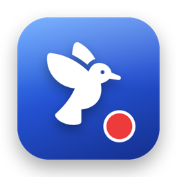
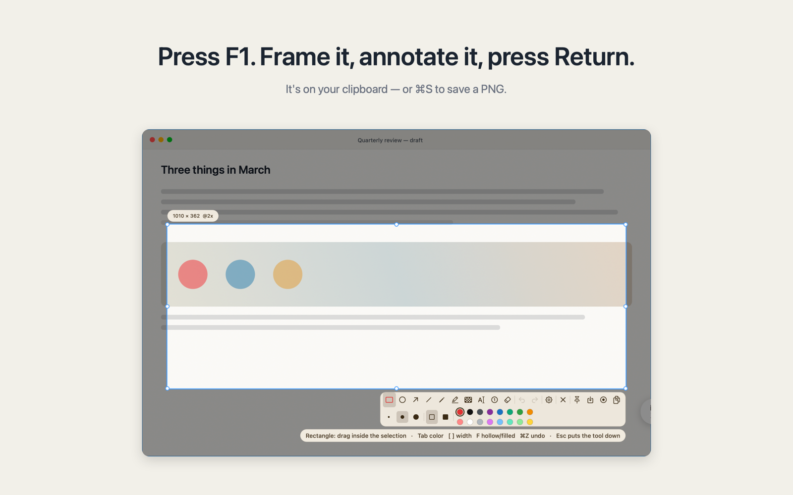

<p align="center"></p>
<h1 align="center">Gigle Pin</h1>

<p align="center"><strong>Snip. Pin. Record.</strong><br>
A native macOS screenshot, pin and screen-recording tool —<br>
and the first one an AI agent can drive without touching your mouse.</p>

<p align="center">
  <a href="https://gigle.ai/pin/"><b>Website</b></a> ·
  <a href="https://gigle.ai/pin/#download"><b>Download for Mac</b></a> ·
  <a href="https://gigle.ai/pin/skill/">Agent skill</a> ·
  <a href="README.zh-Hans.md">简体中文</a>
</p>

<p align="center">
  
  
  
  
</p>

<p align="center">
  <a href="https://gigle.ai/pin/">
    
  </a>
</p>

---

**Gigle Pin** takes a region of your screen, pins it above every window, or
records it — capture, pin and video in one native app. Swift and AppKit, zero
third-party dependencies, under 3 MB, and it opens the moment you press the key.

The part nothing else does: **an AI can drive all of it over `pin://` without
touching your mouse or taking your focus.** It records while you keep working.

That matters more every month. A large share of screenshots and walkthroughs are
now taken *for* a model to read — and increasingly the one that should be doing
the recording **is** the model, demonstrating software it just changed. Every
other tool in this category makes that agent fight you for the cursor.

[Snipaste](https://snipaste.com) is the one worth beating here, and its
pin-to-screen alone is worth the install. Two things it cannot do: record video,
and be driven by an AI. Pin does both.

## Install

**Just want the app?** [Download it from gigle.ai/pin](https://gigle.ai/pin/#download) —
signed and notarized, no account, nothing leaves your Mac. App Store version on its way.

**Want to change it?** That is why the source is here.

```bash
brew install xcodegen && xcodegen generate && scripts/build.sh
```

Set `DEVELOPMENT_TEAM` in `project.yml` to your own team first — see
[CONTRIBUTING.md](CONTRIBUTING.md).

## Demo

https://github.com/user-attachments/assets/b58ae0e9-13d7-4a42-98de-7acac5ec5c8d

<p align="center"><sub>Real use, 43 seconds, with sound — the player starts muted.
<b>No player above?</b> GitHub serves that video from its own attachment store, which has dropped one before —
watch it at <a href="https://gigle.ai/pin/">gigle.ai/pin</a> instead, or open
<a href="docs/media/pin-film.mp4">docs/media/pin-film.mp4</a>, the shorter film, in this repository.</sub></p>

## What it does

| | |
| --- | --- |
| **Capture** | Freeze every display, snap to windows or to single controls, annotate, read pixel colours. |
| **Pin** | Park a shot above every window — zoom, fade, click through it, hide them all with one key. |
| **Record** | Region to MP4 or GIF, system audio and mic, pause that is actually cut from the timeline, and hold-and-drag to draw on the screen mid-demo (`⌥` by default, or `⌃⌥` / `⌘⌥` / `⌃⌘` / `fn`). |
| **Review** | Stops on the last frame. Scrub, slow down, place annotations on the timeline — they get burned into the export. |

| Key | |
| --- | --- |
| `F1` | Capture a region |
| `F1` twice | Record instead |
| `⇧F1` | Pin the clipboard |
| `⌘⇧F1` | Hide / show every pin |

All rebindable. `F1` is Snipaste's key on purpose — macOS never reports the
conflict (`RegisterEventHotKey` returns `noErr` either way), so first launch asks
you to press it once and tells you whether Pin got it.

## For AI agents

An agent asks Pin to record a region, reports its own clicks so they appear as
ripples in the video, and draws on the result:

```bash
open -g "pin://record?x=0&y=0&w=1440&h=900&seconds=20&out=/tmp/demo.mp4"
open -g "pin://ripple?x=700&y=420"          # I clicked here
open -g "pin://ink?x1=.2&y1=.3&x2=.5&y2=.6&tool=arrow"
```

Agent clicks are posted straight to a process and never enter the system event
stream, so Pin cannot see them — which is why the agent reports them itself.

[`.agents/skills/pin-screen-recorder/SKILL.md`](.agents/skills/pin-screen-recorder/SKILL.md)
is the one file Claude Code and Codex both read. It ships inside the app bundle,
so an agent that finds Pin on disk can read it offline — and it is served at
[gigle.ai/pin/skill](https://gigle.ai/pin/skill/) for one that cannot.

Pin never writes to your agent directories on its own. Settings ▸ AI has a button
for that, and it removes only what it put there.

## Docs

- **[docs/lessons.md](docs/lessons.md)** — what we got wrong first, and the
  measurement that settled each one. Blurry recordings were a colour flag, not
  the bitrate; a still screen produces no frames at all; four of our tests passed
  against code that was provably broken. Read this before changing anything.
- **[AGENTS.md](AGENTS.md)** — the rules that keep this codebase coherent.
- **[CONTRIBUTING.md](CONTRIBUTING.md)** — build, verify, send a change.
- **[SECURITY.md](SECURITY.md)** — how to report a vulnerability privately, and
  what `pin://` does and does not protect against.

## License

Code is MIT — take it, change it, ship it.

The name *Gigle Pin*, the bird mark, the icon and the film in this README are
Gigle.AI's trademarks and are **not** covered by that licence. Fork freely; give
your fork its own name and icon so nobody downloads it thinking it came from us.

Built by [Gigle.AI](https://gigle.ai).
