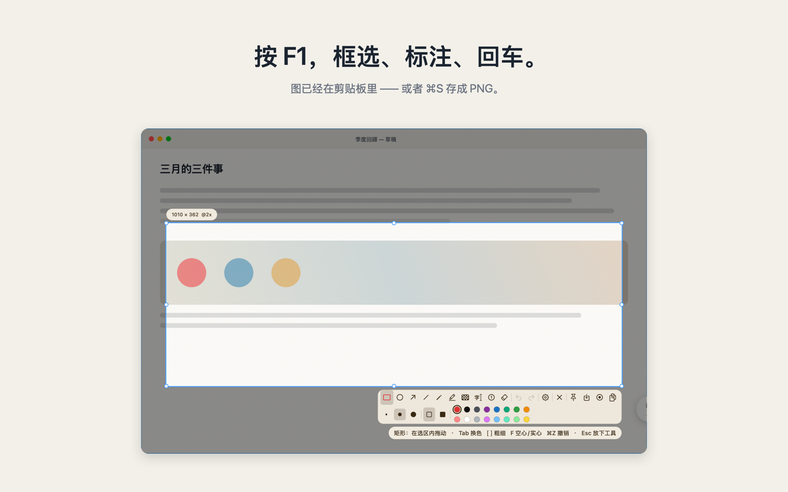

<p align="center"></p>
<h1 align="center">Gigle Pin</h1>

<p align="center"><strong>截图 · 贴图 · 录屏</strong><br>
macOS 原生的截图、贴图与录屏工具 ——<br>
也是第一个能让 AI 直接驱动、却不碰你鼠标的那个。</p>

<p align="center">
  <a href="https://gigle.ai/pin/"><b>官网</b></a> ·
  <a href="https://gigle.ai/pin/#download"><b>下载 Mac 版</b></a> ·
  <a href="https://gigle.ai/pin/skill/">给 AI 的说明书</a> ·
  <a href="README.md">English</a>
</p>

<p align="center">
  
  
  
  
</p>

<p align="center">
  <a href="https://gigle.ai/pin/">
    
  </a>
</p>

---

**Gigle Pin** 把屏幕上的一块框下来、钉在所有窗口之上，或者直接录成视频 ——
截图、贴图、录屏做进同一个原生应用。Swift + AppKit，零第三方依赖，不到 3 MB，
按下键的那一刻就已经在了。

别人没有的那一半：**AI 可以通过 `pin://` 驱动它的全部能力，全程不碰你的鼠标、不抢你的焦点。**
它在录，你照常干活。

这件事的分量每个月都在变重。今天很大一部分截图和演示录像，本来就是**截给模型看的**；
而且越来越多的时候，该动手录的那一个**就是模型自己** —— 它刚改完代码，要把效果演示出来。
这个品类里的其它工具没有为这件事设计过：agent 想录一段，只能去抢你的鼠标。

[Snipaste](https://snipaste.com) 是这里最值得对标的那一个，光「把图钉在屏幕上」
就值得装。它有两件事做不到：录视频，以及被 AI 驱动。Pin 两样都做。

## 安装

**只想用？** [去 gigle.ai/pin 下载](https://gigle.ai/pin/#download) —— 已签名并公证，
不用注册账号，任何东西都不离开你的 Mac。App Store 版在路上。

**想改它？** 源码放在这儿就是为了这个。

```bash
brew install xcodegen && xcodegen generate && scripts/build.sh
```

先把 `project.yml` 里的 `DEVELOPMENT_TEAM` 换成你自己的团队 —— 见
[CONTRIBUTING.md](CONTRIBUTING.md)。

## 演示

https://github.com/user-attachments/assets/b58ae0e9-13d7-4a42-98de-7acac5ec5c8d

<p align="center"><sub>真实使用，43 秒（有声音，播放器默认静音，记得取消静音）。
<b>上面没有播放器？</b>那个视频存在 GitHub 自己的附件库里，它掉过一次 ——
可以去 <a href="https://gigle.ai/pin/">gigle.ai/pin</a> 看，或者打开仓库里那支更短的
<a href="docs/media/pin-film.mp4">docs/media/pin-film.mp4</a>。</sub></p>

## 它能做什么

| | |
| --- | --- |
| **截图** | 一次冻结全部显示器，吸附到窗口甚至窗口内的单个控件，画标注，读像素颜色。 |
| **贴图** | 把图钉在所有窗口之上 —— 缩放、调透明、鼠标穿透，一个键收起全部。 |
| **录屏** | 区域录成 MP4 或 GIF，系统声音与麦克风，暂停那段**真的从时间轴上抠掉**，演示中按住修饰键就能在画面上画（默认 `⌥`，也可以换成 `⌃⌥` / `⌘⌥` / `⌃⌘` / `fn`）。 |
| **回放** | 停在最后一帧。拖进度条、慢放、把批注放在时间轴上 —— 导出时会烧进视频。 |

| 键 | |
| --- | --- |
| `F1` | 截取一块区域 |
| `F1` 连按两下 | 改为录制 |
| `⇧F1` | 把剪贴板里的图钉上屏 |
| `⌘⇧F1` | 隐藏 / 显示全部贴图 |

都可以改。默认占 `F1` 是**故意跟 Snipaste 撞的** —— macOS 从不上报这种冲突
（`RegisterEventHotKey` 两种情况都返回 `noErr`），所以首次启动会请你按一次，
直接告诉你 Pin 有没有收到。

## 给 AI agent 用

agent 让 Pin 录一块区域，把自己点了哪里报回来（于是视频里有水波），再在结果上画：

```bash
open -g "pin://record?x=0&y=0&w=1440&h=900&seconds=20&out=/tmp/demo.mp4"
open -g "pin://ripple?x=700&y=420"          # 我点了这里
open -g "pin://ink?x1=.2&y1=.3&x2=.5&y2=.6&tool=arrow"
```

agent 的点击是直接投递给目标进程的，从不进入系统事件流，所以 Pin 看不见 ——
这正是它必须主动上报的原因。

[`.agents/skills/pin-screen-recorder/SKILL.md`](.agents/skills/pin-screen-recorder/SKILL.md)
是 Claude Code 和 Codex 读的同一份说明书。它随 App 包一起分发，agent 在磁盘上找到 Pin
就能离线读到；读不到的，还有 [gigle.ai/pin/skill](https://gigle.ai/pin/skill/)。

**Pin 不会自作主张往你的 agent 目录里写东西。** 设置 ▸ AI 里有个按钮负责这件事，
而且移除时只删它自己放进去的。

## 文档

- **[docs/lessons.md](docs/lessons.md)** —— 我们一开始搞错的那些事，以及把每一条
  定下来的实测数据。录屏发糊的真凶是色彩范围标记而不是码率；静止的屏幕根本不产生帧；
  我们有四个测试是在明知有 bug 的代码上跑绿的。**改任何东西之前先读它。**
- **[AGENTS.md](AGENTS.md)** —— 让这份代码保持自洽的那几条铁律。
- **[CONTRIBUTING.md](CONTRIBUTING.md)** —— 怎么编译、怎么验、怎么提改动。
- **[SECURITY.md](SECURITY.md)** —— 怎么私下报漏洞，以及 `pin://` 挡什么、不挡什么。

## 许可

代码是 MIT —— 拿去、改它、发布它。

但 **Gigle Pin 这个名字、小鸟标志、图标，以及 README 里这支片子，是 Gigle.AI 的商标，
不在该许可范围内。** 尽管 fork，只是请给你的版本换个名字和图标 ——
别让人以为下载的是我们发的。

由 [Gigle.AI](https://gigle.ai) 打造。
